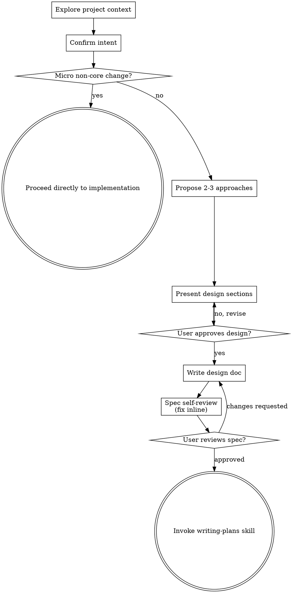

# Brainstorming Ideas Into Designs

Help turn ideas into fully formed designs and specs through natural collaborative dialogue.

Start by understanding the current project context, then ask questions one at a time to refine the idea. Once you understand what you're building, present the design and get user approval.

<HARD-GATE>
Confirm intent before implementation, then classify scope using observable criteria:

- **Micro, non-core change:** one localized adjustment with clear acceptance criteria that does not change product scope, architecture, data models, public APIs, persistence, security boundaries, or cross-component behavior. Confirm the requested outcome briefly, then proceed directly to the appropriate implementation skill. **Do not write a specification, design document, implementation plan, or documentation commit.**
- **Core or substantial change:** new capability, changed product behavior across components, architectural or data-flow decisions, migrations, security-sensitive behavior, or multiple meaningful implementation approaches. Complete the full design and specification workflow below before implementation.

When uncertain, ask one focused question and classify again. File count or coding time alone does not determine scope.
</HARD-GATE>

## Do Not Turn Micro Changes Into Specifications

Brainstorming is still required for micro changes because intent and success criteria must be understood. Its output for a micro change is a concise confirmation, not an artifact. Once the user confirms—or the request already states the outcome unambiguously—implement without proposing multiple approaches, writing specs, committing docs, or invoking `writing-plans`.

## Checklist

You MUST create a task for each of these items and complete them in order:

1. **Explore project context** — inspect only what is needed to understand the requested change.
2. **Confirm intent** — ask focused questions one at a time only when the outcome, constraints, or success criteria are unclear.
3. **Classify scope** — micro non-core or core/substantial, using the hard-gate criteria above.
4. **Micro path** — state the narrow change and preserved behavior, then proceed directly to implementation. Stop the brainstorming workflow here.
5. **Core path: offer the visual companion just-in-time** — only when a real visual question would be clearer shown than described.
6. **Core path: propose 2-3 approaches** — with trade-offs and a recommendation.
7. **Core path: present and approve the design** — validate sections at an appropriate level of detail.
8. **Core path: write and self-review the design spec** — save, commit, and ask the user to review it.
9. **Core path: transition to implementation planning** — invoke `writing-plans`.

## Process Flow

**Terminal state depends on scope.** Micro non-core changes proceed directly to the appropriate implementation skill with no spec or plan artifact. Core/substantial changes terminate by invoking `writing-plans`; do not invoke another implementation skill first.

## The Process

**Understanding and classifying the idea:**

- Inspect the minimum project context needed to understand the change. Read docs or recent commits only when they affect classification or acceptance criteria.
- For a micro non-core change, summarize the requested adjustment and explicitly name what remains unchanged. If the request is already unambiguous, this is sufficient confirmation; proceed directly to implementation.
- Before asking detailed questions, assess scope: if the request describes multiple independent subsystems (e.g., "build a platform with chat, file storage, billing, and analytics"), flag this immediately. Don't spend questions refining details of a project that needs to be decomposed first.
- If the project is too large for a single spec, help the user decompose into sub-projects: what are the independent pieces, how do they relate, what order should they be built? Then brainstorm the first sub-project through the normal design flow. Each sub-project gets its own spec → plan → implementation cycle.
- For appropriately-scoped projects, ask questions one at a time to refine the idea
- Prefer multiple choice questions when possible, but open-ended is fine too
- Only one question per message - if a topic needs more exploration, break it into multiple questions
- Focus on understanding: purpose, constraints, success criteria

**Exploring approaches (core/substantial changes only):**

- Propose 2-3 different approaches with trade-offs
- Present options conversationally with your recommendation and reasoning
- Lead with your recommended option and explain why

**Presenting the design (core/substantial changes only):**

- Once you believe you understand what you're building, present the design
- Scale each section to its complexity: a few sentences if straightforward, up to 200-300 words if nuanced
- Ask after each section whether it looks right so far
- Cover: architecture, components, data flow, error handling, testing
- Be ready to go back and clarify if something doesn't make sense

**Design for isolation and clarity:**

- Break the system into smaller units that each have one clear purpose, communicate through well-defined interfaces, and can be understood and tested independently
- For each unit, you should be able to answer: what does it do, how do you use it, and what does it depend on?
- Can someone understand what a unit does without reading its internals? Can you change the internals without breaking consumers? If not, the boundaries need work.
- Smaller, well-bounded units are also easier for you to work with - you reason better about code you can hold in context at once, and your edits are more reliable when files are focused. When a file grows large, that's often a signal that it's doing too much.

**Working in existing codebases:**

- Explore the current structure before proposing changes. Follow existing patterns.
- Where existing code has problems that affect the work (e.g., a file that's grown too large, unclear boundaries, tangled responsibilities), include targeted improvements as part of the design - the way a good developer improves code they're working in.
- Don't propose unrelated refactoring. Stay focused on what serves the current goal.

## After the Design — Core/Substantial Changes Only

**Documentation:**

- Write the validated design (spec) to `docs/superpowers/specs/YYYY-MM-DD-<topic>-design.md`
  - (User preferences for spec location override this default)
- Use elements-of-style:writing-clearly-and-concisely skill if available
- Commit the design document to git

**Spec Self-Review:**
After writing the spec document, look at it with fresh eyes:

1. **Placeholder scan:** Any "TBD", "TODO", incomplete sections, or vague requirements? Fix them.
2. **Internal consistency:** Do any sections contradict each other? Does the architecture match the feature descriptions?
3. **Scope check:** Is this focused enough for a single implementation plan, or does it need decomposition?
4. **Ambiguity check:** Could any requirement be interpreted two different ways? If so, pick one and make it explicit.

Fix any issues inline. No need to re-review — just fix and move on.

**User Review Gate (core/substantial changes only):**
After the spec review loop passes, ask the user to review the written spec before proceeding:

> "Spec written and committed to `<path>`. Please review it and let me know if you want to make any changes before we start writing out the implementation plan."

Wait for the user's response. If they request changes, make them and re-run the spec review loop. Only proceed once the user approves.

**Implementation (core/substantial changes only):**

- Invoke the writing-plans skill to create a detailed implementation plan
- Do NOT invoke any other skill. writing-plans is the next step.

## Key Principles

- **One question at a time** - Don't overwhelm with multiple questions
- **Multiple choice preferred** - Easier to answer than open-ended when possible
- **YAGNI ruthlessly** - Remove unnecessary features from all designs
- **Explore alternatives for core changes** - Propose 2-3 approaches before settling
- **Incremental validation for core changes** - Present design, get approval before moving on
- **Be flexible** - Go back and clarify when something doesn't make sense

## Visual Companion

A browser-based companion for showing mockups, diagrams, and visual options during brainstorming. Available as a tool — not a mode. Accepting the companion means it's available for questions that benefit from visual treatment; it does NOT mean every question goes through the browser.

**Offering the companion (just-in-time):** Do NOT offer it upfront. Wait until a question would genuinely be clearer shown than told — a real mockup / layout / diagram question, not merely a UI *topic*. The first time that happens, offer it then, as its own message:
> "This next part might be easier if I show you — I can put together mockups, diagrams, and comparisons in a browser tab as we go. It's still new and can be token-intensive. Want me to? I'll open it for you."

**This offer MUST be its own message.** Only the offer — no clarifying question, summary, or other content. Wait for the user's response. If they accept, start the server with `--open` so their browser opens to the first screen automatically. If they decline, continue text-only and don't offer again unless they raise it.

**Per-question decision:** Even after the user accepts, decide FOR EACH QUESTION whether to use the browser or the terminal. The test: **would the user understand this better by seeing it than reading it?**

- **Use the browser** for content that IS visual — mockups, wireframes, layout comparisons, architecture diagrams, side-by-side visual designs
- **Use the terminal** for content that is text — requirements questions, conceptual choices, tradeoff lists, A/B/C/D text options, scope decisions

A question about a UI topic is not automatically a visual question. "What does personality mean in this context?" is a conceptual question — use the terminal. "Which wizard layout works better?" is a visual question — use the browser.

If they agree to the companion, read the detailed guide before proceeding:
`skills/brainstorming/visual-companion.md`
